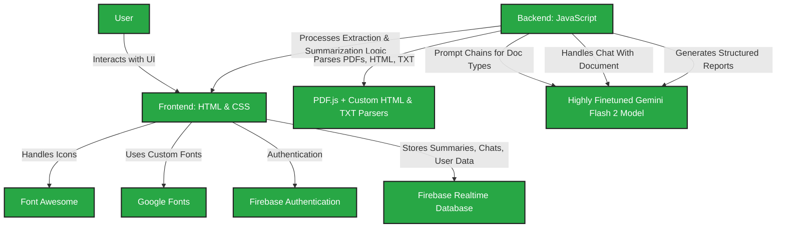

# **NoLegalese.ai**

**Turning Complex Docs into Digestible Insights**

**NoLegalese.ai** turns 80-page documents into 8-second reports. Drop in any **policy, court judgment, contract, research paper, standard, treaty, compliance memo or news article**. Our AI picks out the **who-must-do-what**, **deadlines**, **money bits**, **definitions**, **citations & quotables**—then hands you a **clean, sharable report**.  

With our **AI chat feature**, you can also ask specific questions about your document and get **instant, contextual answers**. Perfect for **lawyers, founders, policy wonks, journalists, researchers**, and **sleepless students**.

## 🚀 **Demo**

[Live Demo >](https://nolegalese-ai.web.app/)

> **Note:** Sensitive credentials and API keys have been omitted from the codebase.

---

## 🎯 **Problem Statement**

Legal, policy, regulatory, and academic documents are often long, complex, and filled with dense, technical language. These documents typically span **hundreds of pages**, requiring readers to manually search for key information such as **obligations, deadlines, penalties, definitions, and decision points**.

Professionals such as **lawyers, founders, compliance officers, journalists, and researchers** routinely face the challenge of extracting actionable insights from these documents under time pressure. Traditional tools are inefficient, and manual reading is slow, error-prone, and mentally taxing.

There is a clear need for an intelligent system that can:
- Quickly process and understand a wide variety of document types  
- Extract structured, relevant, and critical insights  
- Enable contextual interaction and querying of the document  
- Present information in a concise and shareable format  

**NoLegalese.ai** addresses this gap by transforming complex documents into simplified, structured reports and enabling instant Q&A-style interactions for deeper understanding — all within seconds.

---

## ✨ **Key Features**

### **📄 Multi-format Document Upload**  
> Upload a PDF, paste raw text, or just drop a link — our engine ingests it all, including full HTML extraction from live web pages.

### **🧠 Smart Report Generation**  
> Automatically pulls key sections based on document type (e.g., obligations, penalties, legal citations) and converts it into a digestible 1–3 page summary.

### **💬 AI Chat with Document**  
> Ask questions like "What’s the force majeure clause?" or "Who’s responsible for disclosures?" and get targeted answers instantly.

### **📤 Export to PDF**  
> Your final report is downloadable, clean, and ready to share.

---

## 📂 **Our Document Types**

We process a wide range of document types, each with specialized extraction algorithms designed for their unique structure and content:

### 🏛 **Policy / Regulation**
> Government policies, regulations, directives and legislative documents that establish rules and frameworks.

### ⚖️ **Court Judgment**
> Legal decisions from courts, tribunals and judicial bodies at any level of the judicial hierarchy.

### 📝 **Contract**
> Agreements between parties including NDAs, MSAs, employment contracts, service agreements and more.

### 🧪 **Research Paper**
> Academic articles, scientific papers and published research in any field of study or industry.

### ✅ **Compliance Guidance**
> Regulatory guidance, compliance frameworks, standards documents and implementation instructions.

### ⚙️ **Technical Standard**
> Industry standards, technical specifications, protocol documentation and best practice guidelines.

### 🤝 **Treaty / Agreement**
> International treaties, multilateral agreements, diplomatic documents and formal arrangements.

### 📰 **News Article**
> News reports, press releases, journalistic content and current affairs from any outlet or publisher.

---

## 📥 **What We Extract**

### 🏛 **Policy / Regulation**
- Title & Date  
- Jurisdiction  
- Summary  
- Scope / Applicability  
- Definitions  
- Exemptions  
- Implementation guidance  
- Cross references  
- Key points  
- Obligations (who must do what)  
- Timelines & deadlines  
- Penalties for violations  
- Benefits  
- Authority contact  

### ⚖️ **Court Judgment**
- Case name  
- Citation  
- Court  
- Date  
- Parties involved  
- Procedural history  
- Facts of the case  
- Legal issues  
- Decision  
- Reasoning (ratio decidendi)  
- Relief granted / Orders  
- Concurring opinions  
- Dissenting opinions  
- Costs  
- Outcome & implications  

### 📝 **Contract**
- Contract name  
- Parties  
- Effective date  
- Term  
- Key obligations  
- Payment terms  
- Confidentiality  
- Representations & warranties  
- Indemnification  
- Dispute resolution  
- Force majeure  
- Termination clauses  
- Amendment procedures  
- Governing law  
- Liabilities  

### 🧪 **Research Paper**
- Title  
- Authors  
- Institution  
- Date  
- DOI / URL  
- Abstract  
- Methodology  
- Data / sample size  
- Funding sources  
- Conflicts of interest  
- Keywords  
- Key findings  
- Limitations  
- Conclusions  

### ✅ **Compliance Guidance**
- Title  
- Regulator  
- Date  
- Scope  
- Requirements  
- Risk areas & controls  
- Enforcement posture  
- Deadlines  
- Penalties  
- Exemptions  
- Self-assessment tools  
- Reporting channels  
- Best practices  

### 📰 **News Article**
- Headline  
- Publication outlet  
- Date  
- Jurisdiction  
- Summary  
- Source link  
- Primary sources cited  
- Key quotes  
- Market impact  
- Affected sectors  
- Next steps  
- Related developments  

### ⚙️ **Technical Standard**
- Standard title  
- Issuing body  
- Version / Year  
- Scope  
- Mandatory / voluntary status  
- Key requirements  
- Implementation guidance  
- Cross references  
- Technical specifications  
- Compliance methods  

### 🤝 **Treaty / Agreement**
- Treaty name  
- Parties  
- Date signed  
- Date effective  
- Summary  
- Obligations  
- Reservations / declarations  
- Enforcement mechanisms  
- Cross references  
- Implementation requirements  
- Dispute procedures

---

## 💬 **AI Chat Assistant**

Our AI document chat feature allows you to have a natural conversation with your document after analysis. The assistant:

- Uses advanced AI to understand document context and structure  
- Maintains conversation history for intuitive follow-up questions  
- Can answer specific questions about content, implications, or relationships  
- Focuses on factual information contained in your document  
- Provides concise, relevant answers rather than lengthy explanations  
- Identifies sections, clauses, and specific provisions on request  

Simply load your document, click **"Chat with Document"** and start asking questions!

### 🧠 **Example Questions:**

> "What are the key obligations in section 4?"  
> "When is the filing deadline for annual reports?"  
> "Explain the force majeure clause and its exceptions."  
> "What penalties apply for late submissions?"  
> "Who needs to approve the changes to governance structure?"  
> "Summarize the methodology used in this research."

---

## 🛠️ **Technology Stack**

- **Frontend:** HTML + CSS  

- **Backend:** JavaScript  

- **Extraction Tools:** PDF.js, Custom HTML Extractor, TXT Parser 

- **AI Model:** Highly Finetuned Gemini Flash 2 (for document-specific summarization & chat)  

- **Icons:** Font Awesome  

- **Fonts:** Google Fonts  

- **Authentication:** Firebase Authentication  

- **Database:** Firebase Realtime Database  

---

## 📋 **Impact & Benefits**

NoLegalese.ai transforms the way professionals engage with complex documents by delivering speed, clarity, and precision at scale.

### ⚡ **Instant Understanding**  
> Go from 200+ pages to actionable insights in seconds. Skip the noise, focus on what matters.

### 🎯 **Bulletproof Compliance**  
> Surface obligations, deadlines, penalties, and exceptions with zero ambiguity — stay audit-ready.

### 🧠 **AI-Powered Chat Assistant**  
> Ask any question and get precise, contextual answers grounded in your document’s content.

### 📄 **Clean, Shareable Reports**  
> Export polished summaries as PDFs to share with teams, clients, or stakeholders.

### 💼 **Built for High-Stakes Work**  
> Whether you're reviewing contracts, decoding policy, or analyzing court rulings — NoLegalese.ai adapts to your workflow.

---

## 🚀 Getting Started

### Requirements:
- A modern web browser with JavaScript enabled.
- Stable internet connection for loading media and syncing data.

### Steps:
1. Open Nolegalese.ai in your browser.  
2. Sign up to create your free account.  
3. Upload your document and start saying no to Legalese!

---

## 🤝 **Contributing**

Contributions are always welcome! Please follow these steps:

1. Fork the repository.  
2. Create a new branch (`git checkout -b feature/your-feature`).  
3. Commit your changes (`git commit -m 'Add your message'`).  
4. Push to the branch (`git push origin feature/your-feature`).  

---

Built with ❤️ to make complex documents easier to understand, faster to analyze, and simpler to act on — built for professionals who move fast and think deep.
